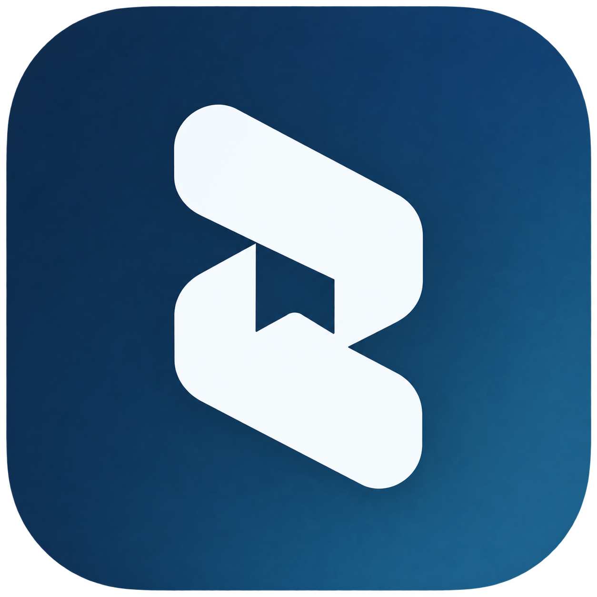
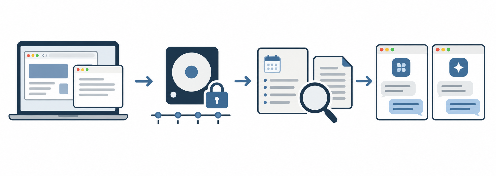

# Side

**[한국어](README.md) · [English](README.en.md)**



**A Mac menu bar app that keeps what you read and work on, so you can find it again later or hand the context straight to your AI agent.**

Side records the working context of your day on-device: browser tabs, text in Mac app windows, sentences you were typing. Search it later by time, keyword, or topic, or connect it to Cursor, Claude Code, or Codex, and the agent reads your recent context on its own when you say "apply what I was just reading in the browser." Side is an independent open-source (MIT) project.

- **It all stays on this Mac.** Records are stored in `~/Library/Application Support/Side/` and are not automatically sent to the cloud. Sensitive values are masked and encrypted before they are saved.
- **Summaries are optional.** Capture and local search work without a model. A model provider may charge for usage when you enable summaries.
- **You decide what is remembered.** Password fields are excluded at the source, and you control the exclusion list, pausing, retention, and deletion from settings.

> **Distributed as source code.** There is no ready-to-run app download yet. Each user builds Side on their own Mac. → [Install](#install)

**Quick links** · [Beginner's guide (한국어)](https://chris-chai-minjae.github.io/side-context-awareness/side-for-beginners.html) · [Detailed manual](docs/manual.en.md) · [Landing page (한국어 · English)](https://chris-chai-minjae.github.io/side-context-awareness/) · [Agent connection guide](docs/agents.en.md) · [MIT License](LICENSE)

## What can you do with it?

1. **Search what you saw earlier.** "Where was that thing I saw yesterday?" Browser history keeps only a list of URLs; Side also searches the **body text** that was actually on screen. For example: "the statute page I had open around 4pm yesterday", "that reference site I skimmed a few days ago."
2. **Automatic activity briefings.** With summaries enabled, Side condenses 10-minute windows and six-hour rollups into a dated timeline of what you did.
3. **Live context for AI agents (MCP).** Register `side mcp` in Cursor, Claude Code, Codex, or another agent, and it reads what you were just looking at through tools such as `history_search` and `history_read`.
4. **Read screens without text (on-device OCR).** For graphic apps and PDFs where the accessibility API returns no text, Side extracts on-screen characters locally with screen recording permission. Images are not stored.

## Why it is different

| Area | What it means |
|---|---|
| Free and open source | Released under the MIT License and runs on your own Mac with no separate server. Cost applies only to the model usage you enable for summaries. |
| Privacy (fully local) | Capture data is stored on this Mac and is not automatically sent to the cloud. Sensitive values are masked and encrypted before storage. |
| Optional model use | A model is used only when you turn on summaries. Without summaries, capture and search stay local. |
| Agent workflow | No more copying documents or error pages into prompts; the agent picks up your recent browsing itself. |
| Control | Password fields are excluded at the source, plus an app and website exclusion list, 15-minute to 1-hour pauses, and per-period or full history deletion. |

In one sentence: **a personal context backend that keeps your Mac activity encrypted on your own machine and makes it immediately readable by you and by agents like Cursor or Claude Code.**

## Real-world uses

You can copy these prompts as they are.

### Professional work (legal, administrative)

**1. Drafting opinions across many statutes, cases, and administrative rules**
- Before: copy each holding, article number, and notice sentence into Word or a prompt window, and re-explain the context every time.
- Now: *"Using the recent Supreme Court holdings and administrative guidance wording I just reviewed in those browser tabs, lay out the illegality/legality issues of our disposition in three 'reasons'."*
- Result: a structured draft that reflects the holdings and guidance you just browsed, with no copy-paste.

**2. Quoting figures from PDFs and locked internal viewers**
- Before: text cannot be copied, so you retype numbers by eye or run a separate screenshot OCR tool.
- Now: *"From the evidence document I just had on screen, pull the 'disposition date' and the 'calculation basis figures' exactly as they read and make a table."*
- Result: screens with no accessibility text are already captured as characters, so you quote the original without typos.

**3. Recovering a train of thought after a call or an unplanned meeting**
- Before: you come back and spend 10 to 20 minutes clicking through tabs trying to remember where you stopped.
- Now: *"Summarize the document paragraph I was focused on right before I went into the meeting an hour ago, and the sentence I was typing in my notes app."*
- Result: the time-stamped activity record and the sentence you were typing are still there, so you pick the thread back up immediately.

**4. Checking for missed issues against the opposing brief**
- Before: copy both the opposing brief and your reply into an AI to ask for a comparison.
- Now: *"Compare the list of core arguments in the opposing brief I just read in the browser (or the audit findings notice) with the counter-arguments I just wrote in the document window, and check whether any issue is missing."*
- Result: you verify coverage with both documents in context at once.

**5. Timesheets and billable hours**
- Before: you cannot recall which case record you read when, so you estimate.
- Now: *"Group by keyword for each case (or project) I worked on today: from when to when I read and wrote documents related to each."*
- Result: work windows per case are organized from actual window-switching times and 10-minute records. Confirm the final billable time yourself.

### Development and research

**6. From web research to a first draft, without restating the sources**
- Before: after 30 minutes of reading guidelines, foreign examples, and statutes, you go back to the editor and drag-copy the key paragraphs into a prompt.
- Now: *"Based on the three or four guideline documents I just reviewed in the browser, pull out three key issues and draft a summary."*
- Result: the agent reads the text of the tabs you just had open and completes the draft.

**7. Applying official docs and error fixes straight to code**
- Before: you keep switching between the browser and the editor to check API parameters and sample code.
- Now: in Cursor or Claude Code, *"Apply the recommended settings and parameters I just confirmed in the official docs to my config file as they are."*
- Result: the code block and parameter spec from the page you read minutes ago are applied directly.

**8. Recovering "where did I read that sentence?" at text level**
- Before: you dig through dozens of history entries and press Ctrl+F on each page.
- Now: *"Find the page URL and surrounding context for the phrase about 'encryption key management' that I saw this morning."*
- Result: even a closed tab is found by the body keyword that was rendered, along with its exact source URL and context.

**9. Daily work log and handover timeline**
- Before: you piece it together from the calendar, commit log, open tabs, and half-written documents.
- Now: *"Brief me on what I moved between from 10am to 4pm today, based on the 10-minute activity summaries."*
- Result: the flow of work is ordered by time and can be shared as a progress report.

## How it works



1. **Capture** Side records readable content from active windows you have allowed, on this Mac. You can exclude apps and websites or pause capture.
2. **Summarize (optional)** With a summary model configured, Side condenses what you did into 10-minute windows, six-hour rollups, and dated pages.
3. **Search** Find what you saw and when by time, word, or topic. For example, "find the restaurant reservation page I saw yesterday evening."
4. **Connect an agent** Register Side as an MCP tool in Claude Code, Codex, Cursor, **Aside**, or another agent to search the same records there. Side.app must be running.

Side does not record your screen continuously. Windows without permission, excluded apps and websites, and password fields are not recorded.

## Install

Side is **distributed as source code only.** You do not download a finished app; each user builds it on their own Mac. Developer ID signing and notarization for a prebuilt app, plus long-duration device testing, are still pending ([development status](docs/qa/)).

Requirements: macOS 14 or later, Bun, Xcode Command Line Tools, and a SQLite dylib with FTS5 and extension loading. The build downloads and bundles the MiniLM model. Homebrew is not required on the Mac that runs the app.

```sh
git clone https://github.com/Chris-Chai-Minjae/side-context-awareness.git
cd side-context-awareness
bun install --frozen-lockfile
bun run build

ditto apps/side-mac/.build/release/Side.app /Applications/Side.app
open /Applications/Side.app
```

Quit any running app with the same name before copying. Side appears in the menu bar rather than the Dock. On first launch, grant capture permissions and enable Context Awareness. Summary provider setup can be skipped; capture and search still work without it.

Build options (`SIDE_SQLITE_LIBRARY`, `SIDE_MODEL_CACHE_SOURCE`), re-granting permissions and Keychain access after a rebuild, and diagnostic commands are in the [detailed manual](docs/manual.en.md).

## macOS permissions

| Permission | How Side uses it |
|---|---|
| Accessibility | Read the active window title, accessibility text, and selected text |
| Input Monitoring | Observe input events to construct typed sentences; password fields and individual keystrokes are not stored |
| Screen Recording | Use on-device OCR to read screen text when readable accessibility text is unavailable; images are not stored |
| Automation | Read the current tab URL in supported browsers |

Screen Recording is optional. Open **Settings → Permissions** from the menu bar to check each permission separately and jump to the matching macOS settings pane. Diagnostic commands and recovery steps for missing permissions or empty summaries are in the [detailed manual](docs/manual.en.md).

## Privacy

Side runs on this Mac. Captured records, summaries, and the search index are all stored in `~/Library/Application Support/Side/`. Sensitive raw values such as titles, URLs, and body text are masked using known patterns and then encrypted, and the encryption key and model API keys are kept in macOS Keychain. Raw captures are not synced to the cloud.

You choose what is kept and for how long.

- **Pause** stop capture for 15 minutes, 30 minutes, one hour, or until you resume.
- **Exclusions** list apps and websites Side should not observe. Password input fields are never recorded.
- **Retention** raw captures last 14 days by default; choose 1, 3, 7, 14, or 30 days.
- **Delete** clear the last 10 minutes, the past hour, today, or all history. Clearing all rotates the encryption key.
- **Disable** turning Context Awareness off stops new capture; existing history remains until retention ends or you delete it.

Storage layout, deletion commands, summary model setup, and full uninstall steps are in the [detailed manual](docs/manual.en.md).

## Connect an agent

While Side.app is running, `side mcp` provides three tools: `history_search`, `history_read`, and `memory_search`. Register Side in each client; it does not connect automatically.

```sh
claude mcp add --scope user side -- "/Applications/Side.app/Contents/Resources/side" mcp
```

Per-client setup and tool usage are in the [agent connection guide](docs/agents.en.md). The MCP server starts even when the daemon is stopped, but tool calls return `Side is not running. Open Side.app.`

## Documentation

- **[Detailed manual](docs/manual.en.md)** build options, permission and rebuild recovery, storage layout, deletion and full uninstall, summary models and cost
- [Beginner's guide](https://chris-chai-minjae.github.io/side-context-awareness/side-for-beginners.en.html) plain-language walkthrough with example questions
- [Agent connection guide](docs/agents.en.md) Claude Code, Codex, Cursor, Grok Build, and Aside setup
- [Landing page](https://chris-chai-minjae.github.io/side-context-awareness/) Korean and English overview
- [Development status](docs/qa/) QA reports and open gates · [Publication history](docs/qa/publication-history.md)

The source is released under the [MIT License](LICENSE).
