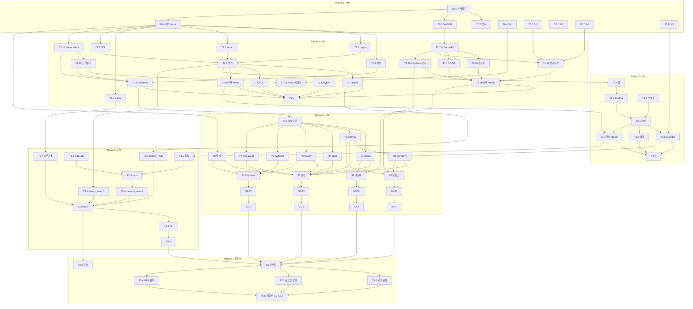

# 06 — TASKS: Side (Canonical Contract)

생성: `/tasks-generator` (Domain-Guarded 모드), 2026-09-24
입력:
- `specs/screens/*.yaml`(4) · `specs/domain/resources.yaml`(16) · `specs/shared/`
- `docs/planning/00~09`
- ICV: needs 누락 0, 필드 커버리지 85%

**공통 규칙**
- 스택: Bun 1.3 + TypeScript strict(`tsconfig.json` 현행 유지) + Swift 5.10+/SwiftUI(macOS 14+). macOS 전용.
- **API 헌법**: `docs/planning/02-architecture.md` §4(JSON-RPC 메서드·인증 규칙). 이 문서 밖의 메서드를 만들지 않는다. 필요하면 문서를 먼저 고친다.
- **TDD**: Phase 1+ 모든 태스크는 RED → GREEN → REFACTOR.
- **완료 판정**: 해당 태스크의 G/W/T 수용 기준 + 연결된 게이트(`08-nfr-test-gates.md` §4)를 명령 출력으로 증명해야 한다.
- **공통 검증 명령**:
  - `bun test <파일>`
  - `npx tsc --noEmit`
  - `npx biome check .`
  - `swift test --package-path apps/side-mac`
- **Worktree**: Phase 0은 main에서 작업한다. Phase 1+는 `worktree/phase-{N}-{영역}`에서 작업한다(P0-T0.1에서 `git init` 이후 사용 가능).
- **상수**: 모든 수치는 `src/constants.ts`에서 가져온다. 코드에 매직 넘버를 쓰지 않는다(G5).

---

## Phase 0 — M0: 셋업 · 계약 · Spike (main)

### [x] P0-T0.1: 저장소 초기화와 스캐폴드
- **담당**: frontend-specialist
- **스펙**: `git init`, `.gitignore`(기존 + `worktree/`, `models/`, `*.dylib` 빌드 산출물), `09-prototype-migration.md`의 목표 디렉터리 생성, `package.json`(이름 `side`, 스크립트 `dev`/`build`/`test`/`check`), 의존성(`sqlite-vec@0.1.9`, `@huggingface/transformers@4.3.0`, `@modelcontextprotocol/sdk@1.30.0`, `ulid`) 추가
- **수용**: Given 현 프로토타입 / When `bun install && bun test && npx tsc --noEmit` / Then 기존 21개 테스트 통과, tsc 0 오류, 첫 커밋 생성
- **게이트**: G0

### [x] P0-T0.2: 상수표 `src/constants.ts`
- **담당**: backend-specialist
- **파일**: `tests/constants.test.ts` → `src/constants.ts`
- **스펙**: `03-capture.md`·`04-data-model.md`·`05-comprehension.md`·`07-recall-index.md`의 상수 계약 + Side 정의값(`CAPTURE_DEBOUNCE_MS=500`, `CA_SIBLING_DEMOTION=0.85`, `PAUSE_INDEFINITE`). 전체 회귀 값은 `tests/constants.test.ts`에 고정하고 각 값에 `[verified]`/`[design]` 주석을 둔다.
- **수용**: Given 승인된 상수 계약과 회귀 값 / When 대조 테스트 실행 / Then 전 항목 일치, 누락 0
- **게이트**: G5

### [x] P0-T0.3: SwiftPM 스켈레톤 `apps/side-mac`
- **담당**: backend-specialist (Swift/macOS)
- **스펙**: 패키지 `SideCaptureKit`(순수 로직, 테스트 가능) + 실행 타깃 `Side`(MenuBarExtra, LSUIElement). 기존 `native/observe.swift`·`key.swift`는 그대로 두고 빌드 스크립트만 병행
- **수용**: Given 빈 패키지 / When `swift build -c release && swift test` / Then 성공, 메뉴바 아이콘이 뜨는 앱 실행
- **게이트**: G0

### [x] P0-T0.4: Spike S-1 — Aside repl 어댑터 부작용·지연
- **담당**: test-specialist
- **스펙**: `scripts/spikes/s1-aside.ts`로 100회 반복(`listBrowserTabs` → `attachActiveBrowserTab` → `snapshot`). 전후 `~/.aside/u/0/sessions/` 항목 수 변화, 포커스 이동, 탭 UI 변화, p50·p95 기록
- **수용**: Given Aside Browser 전경 / When 스크립트 실행 / Then `00-decisions.md` Spike 표에 결과·판정(합격: 세션 증가 0, 포커스 변화 0, p95 ≤ 800ms) 기록
- **병렬**: T0.5~T0.8과 병렬

### [x] P0-T0.5: Spike S-2 — Chromium `AXManualAccessibility`
- **담당**: backend-specialist (Swift/macOS)
- **스펙**: Chrome·Arc·Brave·Edge·Aside에서 속성 설정 전후 AX 텍스트 바이트, 설정 후 첫 트리 준비 시간, CPU 추가분 측정
- **수용**: Then 브라우저별 본문 ≥ 2048B 여부와 CPU ≤ 1% 여부를 표로 기록
- **병렬**: 가능

### [x] P0-T0.6: Spike S-3 — 오디오 재생 감지
- **담당**: backend-specialist (Swift/macOS)
- **스펙**: 후보 비교 — CoreAudio 프로세스 탭(`kAudioHardwarePropertyProcessObjectList` + `kAudioProcessPropertyIsRunningOutput`, macOS 14.2+), Aside `listBrowserTabs().audible` 필드 유무, Chrome AX 탭 제목의 재생 표식
- **수용**: Then 1s 안에 판별되는 방법 1개를 채택하거나 "미채택"을 기록

### [x] P0-T0.7: Spike S-4 — 시크릿/비공개 창 감지
- **담당**: backend-specialist (Swift/macOS)
- **스펙**: Chrome 계열 AppleScript `mode of front window`, Safari 비공개 창(AX 속성·창 제목·AppleScript) 판별 가능성
- **수용**: Then 브라우저별 판별 가능 여부 기록. Safari가 불가면 `03-capture.md` §7에 한계 명시

### [x] P0-T0.8: Spike S-5 — 게이트웨이별 강제 tool call
- **담당**: backend-specialist
- **스펙**: MiMo 2.6 Pro, MiniMax M3, LAN LiteLLM 프록시(`192.168.1.141:8500`)에 `05-comprehension.md` §5 스키마로 `tool_choice` 강제 호출. 증거 없는 합성 briefing만 사용 `[사용자 확정 2026-09-24: :8500]`
- **수용**: Then 게이트웨이별 `supportsToolChoice`, 400 여부, 응답 지연을 기록하고 `settings.providers` 기본값에 반영

### [x] P0-T0.9: 계약 & Mock (M0.5)
- **담당**: backend-specialist
- **파일**: `tests/contracts/*.test.ts` → `src/contracts/{settings,protocol,rpc,summary}.ts`, `tests/mocks/{fake-helper,fake-provider,fake-clock}.ts`
- **스펙**:
  - zod 스키마: settings v2(`02` §6), helper 메시지(`02` §3), RPC 메서드 입출력(`02` §4, resources.yaml 필드명), `record_summary` 인자(`05` §5)
  - fake helper: stdio JSON-lines로 시나리오 이벤트 재생
  - fake provider: 정상·400·429·잘못된 JSON·계약 위반 모드를 가진 HTTP 서버
- **수용**: Given 스키마 / When 계약 테스트 / Then resources.yaml의 모든 필드가 RPC 출력 스키마에 존재(ICV 자동화), fake 3종이 구동됨
- **게이트**: G0

---

## Phase 1 — M1: 관찰 → ledger

### TS 엔진 (`worktree/phase-1-engine`)

### [x] P1-T1.1: 설정 v2 + 마이그레이션
- **담당**: backend-specialist · **의존**: P0-T0.9
- **파일**: `tests/config.test.ts`(기존 확장) → `src/config/index.ts`, `src/config/migrate.ts`
- **스펙**: `02` §6 스키마, v1→v2(`deniedApps`/`deniedWebsites`→rules, `"indefinite"`→`PAUSE_INDEFINITE`, `intervalSeconds` 폐기), 데이터 디렉터리 `Side`(`LCA_DATA_DIR` 읽기 호환), 원자적 저장 0600
- **수용**: Given v1 config 파일 / When load / Then v2로 변환·저장되고 규칙 수가 보존됨. 잘못된 키는 zod 오류
- **게이트**: G9 · **병렬**: T1.2~T1.4와 병렬

### [x] P1-T1.2: crypto — HKDF subkey + AAD
- **담당**: security-specialist · **의존**: P0-T0.9
- **파일**: `tests/crypto.test.ts` → `src/crypto/index.ts`
- **스펙**: `04` §4 — subkey 3종(`evidence`, `terms`, `content-hash`), `seal(value, key, aad)`/`open(..., aad)`, 기존 포맷 호환
- **수용**: Given 다른 aad로 봉인한 값 / When open / Then 인증 실패. 기존 포맷 값은 aad 없이 열림(마이그레이션 경로)
- **병렬**: 가능

### [x] P1-T1.3: redaction 확장 + 골든 코퍼스
- **담당**: security-specialist
- **파일**: `tests/redact.test.ts`, `tests/fixtures/redaction-corpus.{ko,en}.json` → `src/redact/index.ts`, `src/redact/fields.ts`
- **스펙**: `03` §6.1–6.2 — `{text, masks}` 반환, 규칙 8종, Luhn, 필드 라벨 정규식(한국어 포함), autocomplete·input type 차단
- **수용**: Given 코퍼스(양성 ≥ 60, 음성 ≥ 40: 일반 숫자·날짜·ISBN 등) / When redact / Then 양성 100% 마스킹, 음성 오탐 ≤ 2%
- **게이트**: G1(단위) · **병렬**: 가능

### [x] P1-T1.4: policy — 규칙 유니온 + 하드 차단
- **담당**: backend-specialist
- **파일**: `tests/policy.test.ts` → `src/policy/index.ts`
- **스펙**: `03` §7 — app/url 규칙, 서브도메인 매칭, 하드 차단 bundle(Side, 1Password, Keychain Access, System Settings), `observe` 규칙 무시
- **수용**: Given `mail.example.com` 규칙 / When `a.mail.example.com` 평가 / Then 차단. `notmail.example.com`은 통과
- **게이트**: G2(단위) · **병렬**: 가능

### [x] P1-T1.5: ledger 정본 DDL + 보조 테이블
- **담당**: database-specialist · **의존**: P0-T0.9
- **파일**: `tests/ledger/schema.test.ts`, `tests/fixtures/aside-ledger-ddl.sql`(DDL 정본) → `src/ledger/schema.ts`
- **스펙**: `04` §2 — 4테이블·13인덱스 원문, `side_*` 4테이블, PRAGMA, `auto_vacuum=INCREMENTAL`, `schema_version` 마이그레이션 러너
- **수용**: Given 빈 파일 / When open / Then `sqlite_master` SQL이 정본 DDL과 공백 정규화 후 동일
- **게이트**: G6

### [x] P1-T1.6: ledger 쓰기 경로
- **담당**: database-specialist · **의존**: T1.2, T1.3, T1.5
- **파일**: `tests/ledger/write.test.ts` → `src/ledger/write.ts`, `src/ledger/terms.ts`
- **스펙**: `04` §3, §5 — ULID, 컬럼별 봉인(AAD=`table:column:id`), blob keyed-hash 중복 제거(`last_seen_at` 갱신), `side_terms`(기존 `indexTerms` 이식), 일 카운터, 이벤트 단위 트랜잭션
- **수용**: Given 같은 본문 이벤트 2건 / When insert / Then blobs 1행, events 2행. DB 파일 바이트에 원문 title·url 0건
- **게이트**: G1

### [x] P1-T1.7: frame 봉인 + 캐시
- **담당**: database-specialist · **의존**: T1.6
- **파일**: `tests/ledger/frames.test.ts` → `src/ledger/frames.ts`
- **스펙**: `04` §5 — cold 10분 / idle 20분, 1024개 배치, 멤버 ≤ 32 & ≤ 4MB, `Bun.zstdCompressSync` level 12(실측 동작 확인), 16MB LRU 읽기 캐시, blob `content` 비우기 + `frame_id/index`
- **수용**: Given blob 100개(가짜 시계 +11분) / When seal / Then frame ≥ 4개, 모든 blob을 원문 그대로 읽음
- **병렬**: T1.8과 병렬

### [x] P1-T1.8: GC · 보존 · 공간 회수 · footprint
- **담당**: database-specialist · **의존**: T1.6
- **파일**: `tests/ledger/gc.test.ts` → `src/ledger/gc.ts`, `src/ledger/stats.ts`
- **스펙**: `04` §6 — 보존 삭제 → frame 재압축 → incremental vacuum / VACUUM(≥16MB) → WAL truncate. footprint 5분 캐시, 통계 필드
- **수용**: Given retention 1일, 이벤트가 2일 전과 오늘에 존재 / When GC / Then 2일 전 events·blobs·frames 0건, summaries 유지
- **게이트**: G8

### [x] P1-T1.9: 삭제 + deletion epoch + write fence
- **담당**: database-specialist · **의존**: T1.6
- **파일**: `tests/ledger/delete.test.ts` → `src/ledger/delete.ts`, `src/ledger/fence.ts`
- **스펙**: `04` §7 — 4개 target 구간, 겹치는 summaries 삭제, dirty day 표시, `all`이면 키 교체 요청(helper `keychain` 경로는 P1-T1.19의 계약 사용), `withFence(fn)` 헬퍼
- **수용**: Given 진행 중 fence 작업 / When `clear` 후 커밋 시도 / Then 커밋이 거부되고 결과가 버려짐
- **게이트**: G3(단위)

### [x] P1-T1.10: helper 프로토콜 클라이언트
- **담당**: backend-specialist · **의존**: P0-T0.9
- **파일**: `tests/helper/protocol.test.ts` → `src/helper/client.ts`, `src/helper/health.ts`
- **스펙**: `02` §3 — stdin/stdout JSON-lines, 줄 4MB 상한, id 상관, 10s 타임아웃, 3연속 타임아웃 시 `protocol-error`, `hello`에서 키 수신(메모리 전용), health 상태기계
- **수용**: Given fake helper / When 명령 1000개(10% 무응답) / Then 응답은 짝이 맞고 무응답은 타임아웃 처리. 키가 로그·환경에 없음
- **병렬**: T1.1~T1.9와 병렬

### [x] P1-T1.11: 스케줄러 + 어텐션 + target
- **담당**: backend-specialist · **의존**: T1.10
- **파일**: `tests/capture/scheduler.test.ts`, `tests/capture/attention.test.ts` → `src/capture/{scheduler,attention,target}.ts`
- **스펙**: `03` §2–4 — 간격·디바운스 공식, 승격, 500ms 연장 한도, 세마포어 2, 스윕 120s·8개·stale 600s, LRU 512, idle·secureInput·pause·denylist 재평가, 전경 변경 시 결과 폐기
- **수용**: Given 가짜 시계 / When navigation 후 300ms에 interaction / Then pending 트리거가 interaction으로 승격되고 deadline 연장 ≤ 500ms. 동시 실행 캡처 최대 2
- **게이트**: G5

### [x] P1-T1.12: 입력 문장 추적 확장
- **담당**: backend-specialist
- **파일**: `tests/typed.test.ts`(기존 확장) → `src/typed/index.ts`
- **스펙**: `03` §5 — submit·blur·`DRAFT_IDLE_MS` flush, `TYPED_RUN_BYTES`, 제외 필드 신호 처리
- **수용**: Given "안녕하세요 반갑" 입력 후 5분 idle / When 시계 진행 / Then 미완성 문장이 flush됨
- **병렬**: 가능

### [x] P1-T1.13: Aside DOM 어댑터 (조건부)
- **담당**: backend-specialist · **의존**: P0-T0.4, T1.11
- **파일**: `tests/capture/aside-adapter.test.ts` → `src/capture/aside-adapter.ts`
- **스펙**: ADR-011 — 전경이 `at.studio.AsideBrowser`이고 설정이 켜져 있을 때만 `aside repl` 실행(5s 타임아웃), 출력 zod 검증, `source='aside_dom'`·`shape='aria'`, 실패 3회면 health `error` + AX 폴백. S-1이 불합격이면 기본 off 유지
- **수용**: Given `aside` 바이너리 없음 / When 캡처 / Then health `unavailable`, AX 경로로 정상 캡처

### [x] P1-T1.14: reconciler + `side daemon` 진입점
- **담당**: backend-specialist · **의존**: T1.1, T1.10, T1.11
- **파일**: `tests/daemon/reconcile.test.ts` → `src/daemon/{index,reconcile}.ts`, `src/cli.ts`
- **스펙**: `02` §5 — reconcile 트리거 4종, pause 타이머, 켤 때 누락 권한 요청, SIGTERM 정상 종료(WAL checkpoint). `src/cli.ts` 서브커맨드 라우터(기존 `start` 스크립트가 가리키는 파일 생성)
- **수용**: Given fake helper(권한 부여) + enabled / When 시작 / Then `state=running`, 이벤트가 ledger에 쌓임. disabled로 patch하면 `observer.configure({paused:true})` 전송

### Swift 앱 (`worktree/phase-1-mac`)

### [x] P1-T1.15: SideCaptureKit 순수 로직
- **담당**: backend-specialist (Swift/macOS) · **의존**: P0-T0.3, P0-T0.9
- **파일**: `apps/side-mac/Tests/SideCaptureKitTests/*` → `apps/side-mac/Sources/SideCaptureKit/{AXText,FieldLabels,Protocol,Chord}.swift`
- **스펙**: `observe.swift` AX BFS 이식(400노드·12,000자·SecureTextField 제외), 라벨 정규식(TS와 같은 케이스 공유: `tests/fixtures/field-labels.json`), JSON-lines 인코더(TS zod와 같은 필드), 단축키 표기
- **수용**: Given 공유 픽스처 / When `swift test` / Then TS 테스트와 같은 판정

### [x] P1-T1.16: 관찰자 — AX · NSWorkspace · EventTap
- **담당**: backend-specialist (Swift/macOS) · **의존**: T1.15
- **파일**: `apps/side-mac/Sources/Side/Capture/{AXObserverHub,WorkspaceObserver,InputTap,IdleMonitor}.swift`
- **스펙**: `03` §1, §4 — 이벤트 종류별 생산자, listen-only tap(수식키 없는 문자키 폐기), 포인터 요소 label, `IsSecureEventInputEnabled`, idle 초, denylist bundle은 관찰자 미등록, 이벤트 → stdout
- **수용**: Given denylist에 TextEdit / When TextEdit에서 입력 / Then 출력 이벤트 0건. 수식키 없는 키 입력은 어떤 이벤트에도 문자로 나타나지 않음
- **게이트**: G2

### [x] P1-T1.17: Vision OCR + 창 캡처
- **담당**: backend-specialist (Swift/macOS) · **의존**: T1.15
- **파일**: `apps/side-mac/Tests/SideCaptureKitTests/OCRTests.swift`(fixture `tests/fixtures/ocr.png` 재사용) → `apps/side-mac/Sources/Side/Capture/WindowOCR.swift`
- **스펙**: ADR-009 — `SCScreenshotManager` 단일 창, `VNRecognizeTextRequest` ko-KR/en-US `.accurate`, 이미지는 메모리에서만 처리(디스크 기록 금지)
- **수용**: Given `ocr.png` / When OCR / Then 기존 tesseract 테스트의 기대 문자열 포함. 임시 파일 생성 0건

### [x] P1-T1.18: 브라우저 URL · 시크릿 · Chromium AX
- **담당**: backend-specialist (Swift/macOS) · **의존**: T1.15, P0-T0.5, P0-T0.7
- **파일**: `apps/side-mac/Sources/Side/Capture/Browsers.swift`
- **스펙**: NSAppleScript 6개 브라우저(`observe.ts` 스크립트 이식), Automation 권한 판별, incognito 차단(S-4 결과), S-2 합격 브라우저에 `AXManualAccessibility`, `chromeOnly`·`maxTreeBytes` health
- **수용**: Given Chrome 시크릿 창 전경 / When 캡처 요청 / Then 결과 폐기 + suppression 보고

### [x] P1-T1.19: Keychain · hello · 데몬 감독
- **담당**: backend-specialist (Swift/macOS) · **의존**: T1.15
- **파일**: `apps/side-mac/Sources/Side/App/{Keychain,Supervisor}.swift`
- **스펙**: `key.swift` 이식(서비스명 유지), `keychain.set/get`(provider 키) 명령, 데몬 spawn + `hello`로 키 전달, 백오프 재시작(1→60s, 분당 5회 초과 시 중단), 전체 삭제 시 키 교체
- **수용**: Given 데몬 강제 종료 6회/분 / When 감독 / Then 5회까지 재시작하고 이후 "Capture is not running" 상태. `ps -E` 출력에 키 없음

### [x] P1-T1.20: 권한 코디네이터 + health
- **담당**: backend-specialist (Swift/macOS) · **의존**: T1.16~T1.19
- **파일**: `apps/side-mac/Sources/Side/App/Permissions.swift`, `Health.swift`
- **스펙**: `03` §8 — 권한 4종 preflight·request, 부여 후 재등록·tap 재생성, Screen Recording 부여 시 재시작 + 시트 재개 플래그, `HelperHealth` 전 필드 30s·변화 시 전송
- **수용**: Given Input Monitoring 회수 / When health / Then `inputMonitoringTrusted=false`, `eventTapHealthy=false`

### [ ] P1-V: M1 통합 검증
- **담당**: test-specialist · **의존**: T1.1~T1.20
- **검증 항목**:
  - [x] fake helper 시나리오(브라우저·편집기·암호 필드·denylist 앱) → ledger 이벤트 종류·개수 기대값 일치
  - [ ] 실제 Mac 30분 사용 후 **G1 카나리아 스캔**(`scripts/gates/g1-canary.ts`) 0건
  - [ ] **G2** denylist 앱·도메인 이벤트 0건, suppression > 0
  - [x] **G6·G8·G9** 통과, `bun test`·`swift test`·tsc·biome 청결(G0)

---

## Phase 2 — M2: 요약 → day page (`worktree/phase-2-comprehension`)

### [x] P2-T2.1: enqueue + claim/lease/retry
- **담당**: backend-specialist · **의존**: P1-T1.6
- **파일**: `tests/comprehension/queue.test.ts` → `src/comprehension/queue.ts`
- **스펙**: `05` §1–2 — 10분·6h 창 정렬(로컬 시간), glance 제외, `LATE_COMMIT_RESCAN_MS` 재요약, claim SQL(`RETURNING`), lease 만료 회수, 재시도 60s/300s, 3회 후 failed, 소스 소멸 시 skipped, 자정 이전 failed의 보존 조건
- **수용**: Given 실패 2회 작업 / When 3번째도 실패 / Then `status='failed'`, `attempt_count=3`. lease 만료 running은 다음 pass에서 재claim

### [x] P2-T2.2: briefing 조립
- **담당**: backend-specialist · **의존**: T2.1
- **파일**: `tests/comprehension/briefing.test.ts`, `tests/fixtures/briefing/*.json` → `src/comprehension/briefing.ts`
- **스펙**: `05` §3 — dwell 세그먼트, 스냅샷 ≤2(Jaccard 0.9 중복 제거), page index ≤10줄, typed ≤4096B, selection ≤600B, revisit ≤4096B, 49,152B 예산과 절단 우선순위, 모든 항목에 `e:` id
- **수용**: Given 100KB 증거 창 / When 조립 / Then 결과 ≤ 49,152B, typed·selection 보존, 등장 id 집합 반환
- **병렬**: T2.3과 병렬

### [x] P2-T2.3: 인젝션 무력화 + nonce 경계
- **담당**: security-specialist
- **파일**: `tests/comprehension/neutralize.test.ts`, `tests/fixtures/injection/*.txt`(10종 이상) → `src/comprehension/neutralize.ts`
- **스펙**: `05` §3.6 — 역할 표식·툴 호출 모양 치환, 가짜 경계 제거, `<untrusted-evidence nonce>` 래핑(호출마다 새 nonce)
- **수용**: Given 경계 태그를 흉내 낸 페이지 / When 무력화 / Then 결과에 실제 nonce 닫는 태그가 정확히 1개
- **게이트**: G7(단위)

### [x] P2-T2.4: 프롬프트 · `record_summary` 계약 · repair
- **담당**: backend-specialist · **의존**: T2.2, T2.3, P0-T0.9
- **파일**: `tests/comprehension/contract.test.ts` → `src/comprehension/{prompt,contract,repair}.ts`
- **스펙**: `05` §4–5 — 시스템 프롬프트 원문, 스키마(`\p{}`와 `pattern` 미사용 — 스키마 문자열 검사 테스트 포함), zod 사후 검증(id·app·domain 부분집합, 비밀 재검사), repair 1회, body 합성
- **수용**: Given briefing에 없는 `e:` id를 인용한 출력 / When 검증 / Then 위반 목록 반환 → repair 메시지에 원출력+규칙 포함
- **게이트**: G4

### [x] P2-T2.5: provider 체인 (OpenAI 호환)
- **담당**: backend-specialist · **의존**: T2.4, P0-T0.8, P1-T1.19(keychain.get 계약)
- **파일**: `tests/comprehension/providers.test.ts`(fake provider) → `src/comprehension/providers.ts`
- **스펙**: `05` §6 — 모델 해석, overrides 정규식, `allowEvidence` 게이트, 폴백 트리거 목록, tool_choice 미지원 JSON 폴백, usage·지연 기록, 본문 로그 금지, 동시 호출 2
- **수용**: Given 1순위 429, 2순위 정상 / When 요약 / Then 2순위 결과로 저장하고 `model`에 2순위 기록. `allowEvidence=false`만 있으면 fake 서버 호출 0회
- **게이트**: G11

### [x] P2-T2.6: 6h 롤업
- **담당**: backend-specialist · **의존**: T2.4
- **파일**: `tests/comprehension/rollup.test.ts` → `src/comprehension/rollup.ts`
- **스펙**: `05` §1(6h enqueue 조건), §3(자식 body ≤3072B, `s:` 인용)
- **수용**: Given 자식 10min 36개 중 30 done·6 failed / When 창 종료 / Then 6h 작업 생성, 입력에 done 30개만 포함

### [x] P2-T2.7: day page 렌더 + digest
- **담당**: backend-specialist · **의존**: T2.4, P1-T1.9
- **파일**: `tests/memory/render.test.ts`(스냅샷) → `src/memory/{render,digest}.ts`
- **스펙**: `07` §1, `05` §7 — 렌더 v3 포맷, Day overview 조건, 요약 0개인 날은 파일 삭제, `withFence` 원자적 쓰기, `digested_at` 갱신, stale day 판정
- **수용**: Given 렌더 중 `clear('lastHour')` 주입 / When 커밋 / Then 파일에 삭제 구간 섹션 없음(100회 반복)
- **게이트**: G3

### [ ] P2-V: M2 통합 검증
- **담당**: test-specialist · **의존**: T2.1~T2.7
- **검증 항목**:
  - [x] fake provider 하루 시나리오 → day page 섹션 수 = 활동 10분 창 수, 섹션마다 Sources ≥ 1
  - [x] **G4**: 위반 출력 모드에서 repair → 재시도 → failed 수렴
  - [x] **G7**: 인젝션 10종 페이지 → 결과에 `PWNED` 0회, 인용 id ⊂ briefing id
  - [ ] **G3·G11** 통과, 실제 provider(S-5 합격분)로 1시간 실사용 요약 수동 확인

---

## Phase 3 — M3: 인덱스 · 회수 · MCP · CLI (`worktree/phase-3-recall`)

### [x] P3-T3.1: day page 청킹
- **담당**: backend-specialist · **의존**: P2-T2.7
- **파일**: `tests/memory/chunk.test.ts` → `src/memory/chunk.ts`
- **스펙**: `07` §2 — 경로 정규식, 섹션 단위, 1,433자 초과 시 문단 분할 + heading 반복, overview 별도 청크, 버전 salt id, 이전 구분자 형식도 파싱
- **수용**: Given 3,000자 섹션 / When 청킹 / Then 청크 3개 이상, 각 청크 ≤ 1,433자, 모두 heading 포함
- **병렬**: T3.5~T3.7과 병렬

### [x] P3-T3.2: index.db + 임베딩 모듈
- **담당**: database-specialist · **의존**: P0-T0.1
- **파일**: `tests/memory/index-db.test.ts`, `tests/memory/embed.test.ts` → `src/memory/{sqlite,index-db,embed}.ts`
- **스펙**: ADR-005 — `Database.setCustomSQLite(<번들 경로 | 개발 시 homebrew>)`를 프로세스 첫 DB 생성 전에 한 번만 호출(ledger도 같은 SQLite 사용), FTS5 `trigram`, vec0 `float[384] cosine`, `paraphrase-multilingual-MiniLM-L12-v2` q8 지연 로드 + 5분 idle 해제, `models/` 캐시
- **수용**: Given 한·영 문장 3개 / When 임베딩·KNN / Then 관련 쌍이 무관 쌍보다 가까움(스파이크 재현: 0.51 vs 0.08 수준)

### [x] P3-T3.3: 인덱스 동기화
- **담당**: backend-specialist · **의존**: T3.1, T3.2
- **파일**: `tests/memory/sync.test.ts` → `src/memory/sync.ts`
- **스펙**: `07` §3 — `memory-index.json` manifest(mtime·sha256·chunk ids), 변경 파일만 재색인, 삭제 파일의 청크 제거, 750ms 디바운스, 배치 4, write fence
- **수용**: Given day page 1개 수정 / When sync / Then 해당 파일 청크만 재임베딩(임베딩 호출 수로 확인)

### [x] P3-T3.4: 하이브리드 검색 (`memory_search`)
- **담당**: backend-specialist · **의존**: T3.3
- **파일**: `tests/memory/search.test.ts` → `src/memory/search.ts`
- **스펙**: `07` §3 — α=0.8 결합, BM25 정규화, hyperbolic recency(7일/21일), sibling demotion 0.85
- **수용**: Given 같은 주제 청크가 1일 전과 30일 전에 있음 / When 검색 / Then 1일 전 청크가 상위. 인접 창 중복은 강등됨

### [x] P3-T3.5: `history_search` (lexical)
- **담당**: backend-specialist · **의존**: P1-T1.6
- **파일**: `tests/recall/search.test.ts` → `src/recall/{terms,passages,search}.ts`
- **스펙**: `07` §4 — `recallTerms`(한·영 불용어·요청어, ≤32), term hash 후보 2000, 필터, `selectPassages`(300자 창), 점수 공식 `+ 4/(1+age/21_600_000)`, URL dedupe, epoch 확인 후 1회 재시도, 결과 ref 형식
- **수용**: Given 동일 URL 이벤트 5건 / When 검색 / Then 결과 1건(최신). 질의 중 `clear` 주입 → 재시도 결과에 삭제분 없음
- **병렬**: T3.1과 병렬

### [x] P3-T3.6: `history_read`
- **담당**: backend-specialist · **의존**: P1-T1.7
- **파일**: `tests/recall/read.test.ts` → `src/recall/read.ts`
- **스펙**: `07` §5 — `e:`/`s:`, `match` + `contextLines`(기본 10, 최대 100), 30,720B 상한, 만료 시 `{expired}` + 인용 요약, 경계 래핑
- **수용**: Given 보존 기간이 지난 e:id / When read / Then `expired=true`와 이를 인용한 `s:` 반환
- **게이트**: G7b

### [x] P3-T3.7: BrowserHistoryProvider
- **담당**: backend-specialist · **의존**: P1-T1.4
- **파일**: `tests/recall/browser-history.test.ts`(합성 Chromium History DB) → `src/recall/browser-history.ts`
- **스펙**: `07` §4.1 — Chrome·Arc·Brave·Edge·Aside 프로필 탐색, 임시 복사본 읽기 전용, `urls`·`visits` 조회, WebKit 타임스탬프 변환, denylist·보존 기간 적용, Safari 제외
- **수용**: Given denylist 도메인 방문이 든 History / When 검색 / Then 해당 도메인 결과 0건. 원본 파일 mtime 불변

### [x] P3-T3.8: MCP 서버 `side mcp`
- **담당**: backend-specialist · **의존**: T3.4, T3.5, T3.6
- **파일**: `tests/mcp/server.test.ts`(SDK client) → `src/mcp/server.ts`
- **스펙**: `07` §6 — stdio 서버, 도구 3종과 스키마·설명(untrusted 경고), 데몬 UDS 클라이언트, 데몬이 없을 때의 오류 메시지, 호출 로그(client name·도구·개수·지연)
- **수용**: Given 데몬 중지 / When `history_search` 호출 / Then 서버는 살아 있고 "Side is not running. Open Side.app." 반환
- **게이트**: G7b

### [x] P3-T3.9: CLI 서브커맨드 + doctor
- **담당**: backend-specialist · **의존**: T3.8, P4-T4.1
- **파일**: `tests/cli/*.test.ts` → `src/cli.ts`, `src/cli/*.ts`
- **스펙**: `07` §7 — status/search/read/memory/pause/resume/clear/digest/doctor/mcp, `--json`, `clear all` 대화형 확인, doctor 점검 6항목
- **수용**: Given custom SQLite 경로 누락 / When `side doctor` / Then 해당 항목 FAIL과 해결 안내, 종료 코드 1

### [x] P3-V: M3 통합 검증
- **담당**: test-specialist · **의존**: T3.1~T3.9
- **검증 항목**:
  - [x] 수용 시나리오 S2: Claude Code에 `claude mcp add side -- <side> mcp` 등록 후 "어제 오후 sqlite 확장 문서" 질의 → 상위 5개에 해당 URL
  - [x] S6: Aside(`mcp.servers`에 등록)와 Claude Code에서 같은 질의 → 같은 ref 집합 ([합성 fixture와 두 클라이언트 원시 tool 결과](../qa/p3-v-aside-s6.md))
  - [x] `history_search` p95 ≤ 300ms, `memory_search` p95 ≤ 500ms(14일 합성 데이터)

---

## Phase 4 — M4: 로컬 API Resource · 화면

### [x] P4-T4.1: API 서버 코어
- **담당**: security-specialist · **의존**: P0-T0.9, P1-T1.14
- **파일**: `tests/api/server.test.ts` → `src/api/{server,auth,rpc}.ts`
- **스펙**: `02` §4 — JSON-RPC 2.0, UDS(0600) + 127.0.0.1 ephemeral, Bearer 토큰(32B, 데몬 시작마다 생성, `run/web.json`에는 해시만), Host 정확 일치, Origin 검사, 요청 본문 1MB 상한, zod 입력 검증
- **수용**: Given 토큰 없음 / 잘못된 Host / 외부 Origin / When 요청 / Then 각각 401/403/403
- **게이트**: G10 · **Worktree**: `worktree/phase-4-resources`

### Resource 태스크 (`worktree/phase-4-resources`, **헌법**: `02-architecture.md` §4, 서로 병렬 가능)

### [x] P4-R1-T1: capture_status · pause · permissions
- **담당**: backend-specialist · **의존**: P4-T4.1
- **리소스**: capture_status, pause, permissions
- **엔드포인트**: RPC `status`, `pause`, `resume`, `permissions`, `requestPermissions`
- **필드**: enabled, state, paused_until, banner, stop_reason, health, today, url_denied / accessibility, input_monitoring, screen_recording, automation
- **파일**: `tests/api/status.test.ts` → `src/api/resources/status.ts`
- **스펙**: banner 판정표(`03` §8.3), pause 입력 2형태, requestPermissions → helper 위임
- **수용**: Given Accessibility 미부여 health / When status / Then `banner='permissions_needed'`

### [x] P4-R2-T1: settings · summary_model_default
- **담당**: backend-specialist · **의존**: P4-T4.1, P1-T1.1
- **리소스**: settings, summary_model_default
- **엔드포인트**: RPC `settings.get`, `settings.patch`, `summaryModelDefault`
- **필드**: enabled, capture_typed_text, screen_ocr, aside_adapter, retention_days, rules, summary_model, default_model, providers / model, source
- **파일**: `tests/api/settings.test.ts` → `src/api/resources/settings.ts`
- **스펙**: 부분 patch 병합 → zod → 원자적 저장 → reconcile. 응답에 API 키 원문 없음
- **수용**: Given `retention_days: 5` / When patch / Then 검증 오류, 파일 불변

### [x] P4-R3-T1: providers
- **담당**: security-specialist · **의존**: P4-R2-T1, P2-T2.5
- **리소스**: providers
- **엔드포인트**: RPC `providers.setKey`, `providers.test` (+ `settings.patch`)
- **필드**: id, base_url, host, models, supports_tool_choice, allow_evidence, has_key, test_result
- **파일**: `tests/api/providers.test.ts` → `src/api/resources/providers.ts`
- **스펙**: setKey → helper `keychain.set`, 데몬 메모리·로그 잔존 금지, test는 증거 없는 고정 프롬프트
- **수용**: Given setKey 호출 / When 로그·settings.json·heap snapshot 문자열 검색 / Then 키 0건

### [x] P4-R4-T1: applications
- **담당**: backend-specialist · **의존**: P4-T4.1
- **리소스**: applications
- **엔드포인트**: RPC `listApplications`, `appIcons`
- **필드**: bundle_id, name, icon_png_base64, denied
- **파일**: `tests/api/applications.test.ts` → `src/api/resources/applications.ts`
- **스펙**: helper `applications.list/icons` 위임, 아이콘 LRU 캐시, denied 표시
- **수용**: Given denylist에 Slack / When listApplications / Then Slack의 `denied=true`

### [x] P4-R5-T1: history (status · summaries · day pages · clear)
- **담당**: backend-specialist · **의존**: P4-T4.1, P2-T2.7, P1-T1.9
- **리소스**: history_status, history_summaries, day_pages, clear_operation
- **엔드포인트**: RPC `historyStatus`, `historyList`, `day.get`, `clear`
- **필드**: store_bytes, average_bytes_per_day, days_with_summaries, today_summary_states / id, kind, window_from, window_to, title, description, status, citations / date, markdown, updated_at / deleted_events, deleted_summaries, deletion_epoch
- **파일**: `tests/api/history.test.ts` → `src/api/resources/history.ts`
- **수용**: Given 오늘 요약 5개 / When `clear('today')` 후 `day.get(today)` / Then 응답이 `null` (`02-architecture.md` §4 및 day-view spec과 동일)

### [x] P4-R6-T1: evidence
- **담당**: backend-specialist · **의존**: P4-T4.1, P3-T3.6
- **리소스**: evidence
- **엔드포인트**: RPC `read`, `search`, `events`
- **필드**: id, occurred_at, app, title, url, text, expired
- **파일**: `tests/api/evidence.test.ts` → `src/api/resources/evidence.ts`
- **스펙**: `history_read`·`history_search` 래핑(MCP와 같은 구현 공유)
- **수용**: Given `e:` id / When read / Then MCP `history_read`와 바이트가 같은 결과

### [x] P4-R7-T1: mcp_usage · agent_connection
- **담당**: backend-specialist · **의존**: P4-T4.1, P3-T3.8
- **리소스**: mcp_usage, agent_connection
- **엔드포인트**: RPC `mcp.usage` (agent_connection은 정적 계산)
- **필드**: client_name, calls, avg_latency_ms / binary_path, claude_code_command, mcp_json_snippet
- **파일**: `tests/api/mcp-usage.test.ts` → `src/api/resources/mcp-usage.ts`
- **수용**: Given MCP 호출 3회(client 2종) / When `mcp.usage({sinceMs:24h})` / Then client별 합계 일치

### Screen 태스크

### [x] P4-S0-T1: 웹 셸 + 공통 컴포넌트
- **담당**: frontend-specialist · **의존**: P0-T0.9 (Mock: fake RPC)
- **화면**: 공통
- **컴포넌트**: `permission_banner`, `pause_control`, `confirm_dialog`, `untrusted_text_view` (`specs/shared/components.yaml`)
- **파일**: `tests/web/shell.test.tsx` → `src/web/{main,router,rpc-client}.tsx`, `src/web/components/*`
- **스펙**: Preact SPA, 외부 CDN 금지, 해시 라우터, 토큰은 앱 주입 → 메모리 보관 후 `history.replaceState`로 URL에서 제거, 다크/라이트, `bun build` 번들 → `src/web/dist`
- **수용**: Given 앱이 주입한 토큰 URL / When 로드 / Then RPC가 인증되고 주소창·history에 토큰 없음. 외부 스크립트 요청 0건
- **Worktree**: `worktree/phase-4-web` · **TDD**: RED → GREEN → REFACTOR
- **데모**: `/demo/phase-4/s0-shell` · **데모 상태**: loading, error, empty, normal
- **병렬**: Resource 태스크와 병렬(Mock 사용)

### [x] P4-S1-T1: 설정 — Context Awareness UI
- **담당**: frontend-specialist · **의존**: P4-S0-T1, P4-R1~R5, R7 (Mock 선개발 가능)
- **화면**: `/settings/context-awareness`
- **컴포넌트**: header, permission_banner, capture_section, denylist_section, summaries_section, history_section, connect_agents_section, never_observe_dialog, clear_dialog, disable_dialog
- **데이터 요구**: capture_status, permissions, settings, summary_model_default, providers, applications, history_status, history_summaries, clear_operation, mcp_usage, agent_connection
- **파일**: `tests/web/settings.test.tsx` → `src/web/pages/settings.tsx`
- **스펙**: `specs/screens/settings-context-awareness.yaml`, 문구는 `06-screens.md` S2~S5 정본
- **수용**: Given fake RPC(각 데모 상태) / When 렌더 / Then 섹션·문구가 `06-screens.md` S2~S5와 문자 단위로 일치(문구 스냅샷 테스트)
- **Worktree**: `worktree/phase-4-web` · **TDD**: RED → GREEN → REFACTOR
- **데모**: `/demo/phase-4/s1-settings` · **데모 상태**: loading, error, empty, normal, permissions_needed, paused

### [x] P4-S1-T2: 설정 화면 통합 테스트
- **담당**: test-specialist · **의존**: P4-S1-T1
- **시나리오** (yaml `tests` 5개):
  - Given Input Monitoring 미부여 / When 접속 / Then "Permissions needed"와 Allow
  - Given enabled / When 스위치 끔 / Then 다이얼로그, 확인 전 patch 0회
  - Given Website 탭 / When "https://Mail.Example.com/inbox" 추가 / Then `mail.example.com` 규칙
  - Given provider / When Send evidence 켬 / Then host 경고, 취소 시 false 유지
  - Given 키 저장 / When settings.get / Then 원문 없음, has_key=true
- **파일**: `tests/e2e/settings.spec.ts` (Playwright, 데몬은 fake helper로 기동)

### [x] P4-S1-V: 설정 화면 연결점 검증
- **담당**: test-specialist
- [x] Field Coverage: yaml `needs` 전 필드가 RPC 응답에 존재(P0-T0.9 계약 테스트 재실행)
- [x] Endpoint: 사용 RPC 16개가 서버에 등록됨
- [x] Navigation: history_section → `/history/:date`
- [x] Auth: 토큰 없이 페이지 RPC 호출 시 401

### [x] P4-S2-T1: Day view UI
- **담당**: frontend-specialist · **의존**: P4-S0-T1, P4-R5-T1, P4-R6-T1
- **화면**: `/history/:date`
- **컴포넌트**: date_nav, day_page, evidence_panel
- **데이터 요구**: day_pages, history_status, evidence
- **파일**: `tests/web/day-view.test.tsx` → `src/web/pages/day-view.tsx`
- **스펙**: 마크다운 렌더(HTML 비활성, sanitize), `e:`/`s:` 링크 → 패널, `#s:<id>` 스크롤, 외부 링크는 기본 브라우저
- **수용**: Given `e:` 링크 클릭 / When 패널 로드 / Then `read` 1회 호출, 본문은 텍스트 노드로만 삽입(innerHTML 사용 0)
- **데모**: `/demo/phase-4/s2-day-view` · **데모 상태**: loading, error, empty, normal, expired-evidence
- **Worktree**: `worktree/phase-4-web` · **TDD**: RED → GREEN → REFACTOR · **병렬**: P4-S1-T1과 병렬

### [x] P4-S2-T2: Day view 통합 테스트
- **담당**: test-specialist · **의존**: P4-S2-T1
- **시나리오**: yaml `tests` 4개(G/W/T 변환) + 증거 본문에 `<script>` 포함 시 실행되지 않음
- **파일**: `tests/e2e/day-view.spec.ts`

### [x] P4-S2-V: Day view 연결점 검증
- **담당**: test-specialist
- [x] Field Coverage: day_pages·evidence·history_status needs
- [x] Endpoint: `day.get`, `read`, `historyStatus`, `clear`
- [x] Navigation: date_nav ↔ 인접 날짜, day_page → 설정
- [x] Auth: 토큰 필수

### [ ] P4-S3-T1: 메뉴바 (SwiftUI)
- **담당**: frontend-specialist (SwiftUI) · **의존**: P1-T1.19, P4-R1-T1
- **화면**: `native://menubar`
- **컴포넌트**: status_line, pause_menu, actions, status_icon
- **데이터 요구**: capture_status
- **파일**: `apps/side-mac/Tests/SideAppTests/MenuStateTests.swift` → `apps/side-mac/Sources/Side/UI/MenuBar.swift`, `SettingsWindow.swift`(WKWebView + 토큰 주입)
- **스펙**: 상태 문구 5종, 아이콘 3종, 30s 캐시 + 열 때 즉시 조회, Quit 절차
- **수용**: Given capture_status 5가지 상태 / When 메뉴 모델 계산 / Then 각 상태 문구·아이콘이 표와 일치
- **데모 상태**: running, paused(timed), paused(indefinite), not_running, permissions_needed
- **Worktree**: `worktree/phase-4-mac` · **TDD**: 상태 매핑은 단위 테스트, 렌더는 수동

### [ ] P4-S3-T2: 메뉴바 통합 테스트
- **담당**: test-specialist · **의존**: P4-S3-T1
- **시나리오**: yaml `tests` 3개. XCUITest 또는 수동 체크리스트(`docs/qa/menubar.md`)로 증거 스크린샷 첨부

### [ ] P4-S3-V: 메뉴바 연결점 검증
- **담당**: test-specialist
- [x] Field Coverage: capture_status needs
- [ ] Endpoint: `status`, `pause`, `resume`, `settings.open`(helper)
- [ ] Navigation: Settings… → `/settings/context-awareness`, Today's summary… → `/history/<오늘>`
- [ ] Auth: WKWebView 외부에서 토큰 URL 재사용 불가(토큰이 URL에 남지 않음)

### [x] P4-S4-T1: 온보딩 (SwiftUI)
- **담당**: frontend-specialist (SwiftUI) · **의존**: P1-T1.20, P4-R2-T1, P4-R3-T1
- **화면**: `native://onboarding`
- **컴포넌트**: intro_step, permission_steps, provider_step, finish_step
- **데이터 요구**: permissions, settings
- **파일**: `apps/side-mac/Tests/SideAppTests/OnboardingFlowTests.swift` → `apps/side-mac/Sources/Side/UI/Onboarding.swift`
- **스펙**: `06-screens.md` S7, 1s 권한 폴링, 딥링크, 재시작 후 이어서 열기, provider 건너뛰기
- **수용**: Given 권한 전부 미부여 / When 단계 진행 / Then 부여 감지 즉시 다음 단계, 건너뛴 Screen Recording은 `screenOcr=false`로 저장
- **데모 상태**: 첫 실행, 부분 부여, 재시작 재개, provider 없음
- **Worktree**: `worktree/phase-4-mac`

### [ ] P4-S4-T2: 온보딩 통합 테스트
- **담당**: test-specialist · **의존**: P4-S4-T1
- **시나리오**: yaml `tests` 3개. 새 macOS 사용자 계정(또는 `tccutil reset`)에서 수동 실행, 스크린 녹화 증거

### [ ] P4-S4-V: 온보딩 연결점 검증
- **담당**: test-specialist
- [x] Field Coverage: permissions·settings needs
- [x] Endpoint: `permissions`, `requestPermissions`, `settings.patch`, `providers.setKey`, `providers.test`
- [ ] Navigation: finish → 메뉴바 상태 running

---

## Phase 5 — 릴리스 (`worktree/phase-5-release`)

### [ ] P5-T5.1: 번들링
- **담당**: backend-specialist · **의존**: P3-V, P4-*-V
- **스펙**: `bun build --compile` → `Contents/Resources/side`, `libsqlite3.dylib`(FTS5 포함 빌드) + `vec0.dylib` 동봉, `setCustomSQLite` 경로를 번들 기준으로 해석, 웹 dist 동봉, 모델은 첫 사용 시 다운로드(진행률 표시) 또는 선택적 동봉
- **수용**: Given homebrew 없는 깨끗한 Mac / When 앱 실행 → `side doctor` / Then 전 항목 PASS

### [ ] P5-T5.2: 서명 · 공증 · 권한 설명
- **담당**: security-specialist · **의존**: T5.1
- **스펙**: Developer ID 서명(내장 `side` 바이너리·dylib 포함), Hardened Runtime, entitlements(`com.apple.security.automation.apple-events`), Info.plist 권한 설명 문자열, `notarytool` 공증 + staple
- **수용**: Given 배포 zip / When `spctl -a -vv Side.app` / Then `accepted`, `source=Notarized Developer ID`

### [ ] P5-T5.3: 로그인 항목
- **담당**: backend-specialist (Swift/macOS) · **의존**: T5.1
- **스펙**: `SMAppService.mainApp.register()`, 메뉴에 "Open at Login" 토글
- **수용**: Given 등록 / When 재부팅 / Then 앱과 데몬이 자동 기동하고 `state=running`

### [ ] P5-T5.4: NFR 벤치 스크립트
- **담당**: test-specialist · **의존**: T5.1
- **파일**: `scripts/bench/{cpu,rss,latency,disk}.ts`
- **스펙**: `08` §1 표 전 항목 측정 → `docs/qa/nfr-report.md`에 실측값 기록, 목표 미달 항목은 원인과 조치
- **수용**: Then 8개 항목 모두 실측값이 기록됨(미달 시 이슈 링크)

### [ ] P5-T5.5: 릴리스 게이트 실행
- **담당**: test-specialist · **의존**: T5.1~T5.4
- **스펙**: `scripts/gates/run-all.ts`로 G0~G11 자동 부분 실행 + 수동 E2E 체크리스트(`08` §3)
- **수용**: Then `docs/qa/gates-<date>.md`에 게이트별 PASS와 증거(명령 출력·파일) 링크. FAIL이 하나라도 있으면 릴리스 금지

### [ ] P5-T5.6: 에이전트 연결 문서 + README
- **담당**: docs-specialist · **의존**: P3-T3.8
- **스펙**: `README.md`(설치·권한·프라이버시·데이터 위치·삭제 방법), `docs/agents.md`(Claude Code·Codex·Cursor·Aside 등록법, 도구 3종 사용 예)
- **수용**: Given 문서만 보고 / When 새 Mac에서 Claude Code 연결 / Then `history_search`가 결과를 반환

---

## 의존성 그래프

## 병렬 실행 그룹

| 그룹 | 태스크 | 조건 |
|---|---|---|
| Spike | P0-T0.4~T0.8 | 서로 독립, T0.1 이후 |
| 엔진 기반 | P1-T1.1·T1.2·T1.3·T1.4·T1.5·T1.10·T1.12 | T0.9 이후 |
| TS ↔ Swift | P1 엔진 트랙 ↔ P1 Swift 트랙 | 계약(T0.9)과 fake helper로 분리 |
| 요약 부품 | P2-T2.2 ↔ T2.3 | |
| 회수 부품 | P3-T3.1·T3.2·T3.5·T3.6·T3.7 | |
| Resource | P4-R1·R2·R4·R5·R6·R7 | T4.1 이후 |
| 화면 | P4-S1 ↔ S2 (웹), S3 ↔ S4 (Swift) | 각자 의존 Resource 완료 또는 Mock |
